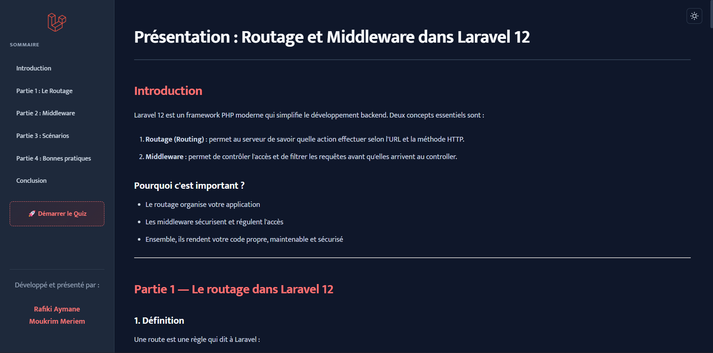
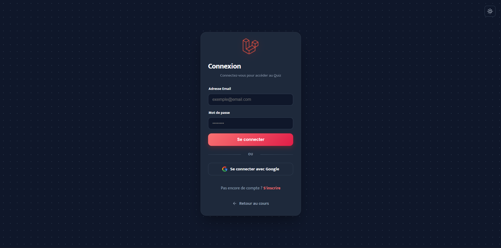
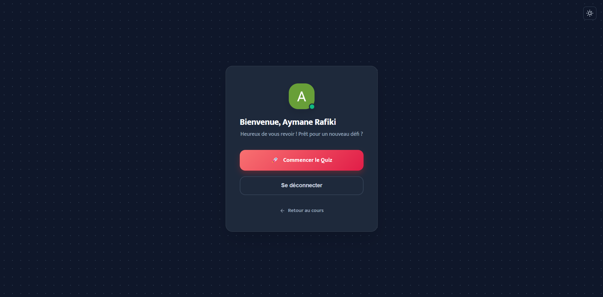
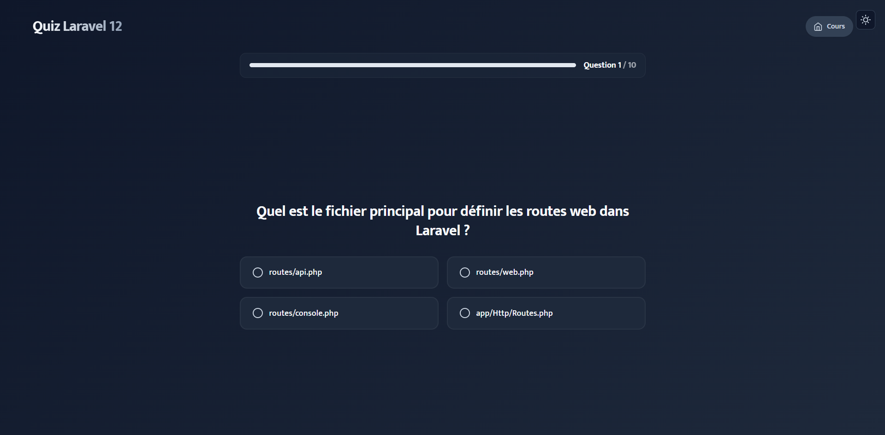
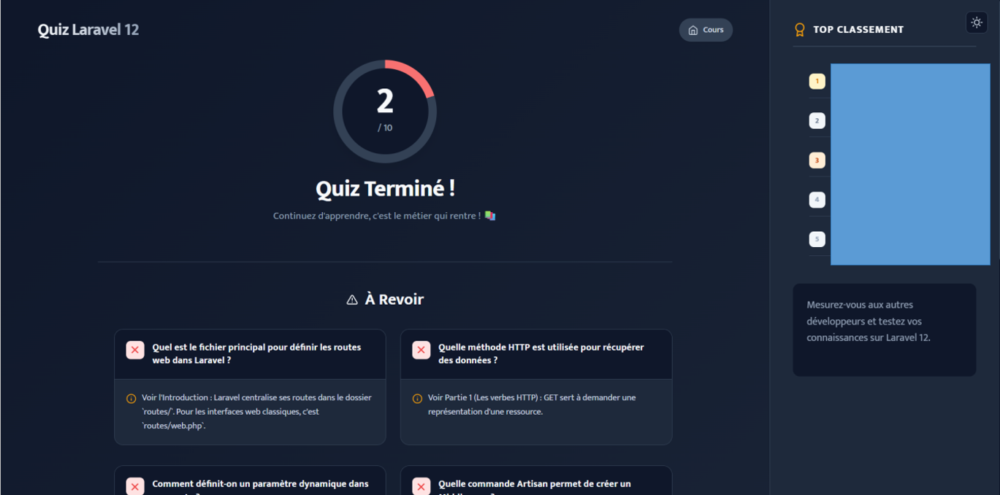

# 🎓 Routage et Middleware - Projet Laravel

Bienvenue dans ce projet de démonstration interactif basé sur **Laravel 12**. Ce projet sert de support visuel et pratique pour comprendre les concepts fondamentaux du Routage et des Middlewares, accompagné d'un quiz interactif gamifié.



## 🌟 Fonctionnalités Principales

### 📚 Partie Cours
*   **Présentation Interactive** : Une interface fluide pour naviguer à travers les concepts clés (Routage simple, Paramètres, Verbes HTTP, Middlewares).
*   **Contenu Dynamique** : Les sections du cours sont chargées depuis des fichiers JSON pour une maintenabilité optimale.
*   **Design Moderne** : Interface épurée avec support du **Dark Mode** 🌙/☀️.

### 🎮 Partie Quiz (Gamification)
*   **Authentification Google** : Connexion rapide et sécurisée via Laravel Socialite.
*   **Quiz Interactif** : 10 questions pour valider les acquis.
*   **Classement (Leaderboard)** : Tableau des 5 meilleurs scores en temps réel.
*   **Anti-Triche Strict** :
    *   ⛔ Si l'utilisateur quitte l'onglet, le quiz s'arrête immédiatement et le score passe à 0.
    *   💾 Sauvegarde automatique de la progression (si vous rafraîchissez la page par erreur, vous ne perdez pas votre place).
*   **Feedback Immédiat** : Explications détaillées pour chaque erreur commise en fin de partie.

### 🛠️ Aspects Techniques Détaillés

#### 📍 Système de Routage (`routes/web.php`)
Le fichier de routes est organisé en **groupes** pour une meilleure lisibilité et maintenance :

1.  **Home & Présentation**
    *   `GET /` : Point d'entrée principal, affiche le cours interactif.

2.  **Authentification (Socialite)**
    *   Groupe préfixé `auth.` :
        *   `GET /auth/google` : Redirige vers Google pour la connexion.
        *   `GET /auth/google/callback` : Gère le retour de Google et crée/connecte l'utilisateur.
        *   `POST /logout` : Déconnexion sécurisée.

3.  **Système de Quiz**
    *   `GET /quiz` : Page d'accueil du quiz (ou connexion si non authentifié).
    *   `GET /login` : Route de secours qui redirige vers `/quiz`.

4.  **Espace de Jeu (Protégé)**
    Ces routes sont enveloppées dans un groupe avec middleware :
    *   `GET /quiz/play` : L'interface de jeu.
    *   `POST /quiz/score` : API pour sauvegarder le score.
    *   `GET /quiz/leaderboard` : API pour récupérer le classement.

#### 🛡️ Middlewares (`app/Http/Middleware`)

Les routes du quiz utilisent une chaîne de responsabilité (Middleware Stack) :

1.  **`auth`** (Standard Laravel) :
    *   Vérifie si l'utilisateur est connecté.
    *   Si non, redirige automatiquement vers la page de login (`/quiz`).

2.  **`log.quiz`** (Personnalisé : `LogQuizActivity.php`) :
    *   C'est un middleware "observateur".
    *   Il intercepte chaque requête vers le jeu pour enregistrer l'activité.
    *   **Code** :
        ```php
        if (auth()->check()) {
            Log::info('Quiz Access', [
                'user_id' => auth()->id(),
                'time' => now()
            ]);
        }
        ```
    *   Cela permet de garder une trace d'audit de qui joue et quand, sans perturber l'expérience utilisateur.

---

## 🚀 Installation et Démarrage

### Prérequis
*   PHP 8.2 ou supérieur
*   Composer
*   Un compte Google Cloud Console (pour les clés API OAuth)

### Étapes d'installation

1.  **Cloner le dépôt**
    ```bash
    git clone <votre-repo-url>
    cd laravel-app
    ```

2.  **Installer les dépendances PHP**
    ```bash
    composer install
    ```

3.  **Configurer l'environnement**
    Copiez le fichier d'exemple et générez la clé d'application :
    ```bash
    cp .env.example .env
    php artisan key:generate
    ```

4.  **Configuration Google OAuth**
    Ouvrez le fichier `.env` et ajoutez vos identifiants Google :
    ```env
    GOOGLE_CLIENT_ID=votre_client_id
    GOOGLE_CLIENT_SECRET=votre_client_secret
    GOOGLE_REDIRECT_URL=http://127.0.0.1:8000/auth/google/callback
    ```

5.  **Préparer la Base de Données**
    Créez le fichier SQLite (ou configurez MySQL dans `.env`) et lancez les migrations :
    ```bash
    # (Sous Windows Powershell)
    New-Item -ItemType File database/database.sqlite
    
    php artisan migrate
    ```

6.  **Lancer le serveur**
    ```bash
    php artisan serve
    ```

    Accédez à l'application sur : `http://127.0.0.1:8000`

---

## 📂 Structure du Projet (Simplifiée)

```
laravel-app/
├── app/
│   ├── Http/
│   │   ├── Controllers/    # PresentationController, QuizController, AuthController
│   │   ├── Middleware/     # LogQuizActivity (Middleware personnalisé)
│   ├── Models/             # User (avec score et google_id)
├── database/
│   ├── migrations/         # Création des tables users (avec ajout de score)
├── resources/
│   ├── data/               # Fichiers JSON du cours (sections/) et du quiz (quiz.json)
│   ├── views/              # Vues Blade (home, quiz/play, auth-login...)
├── routes/
│   └── web.php             # Définition des routes et groupes de middleware
```

## 🛡️ Sécurité & Anti-Triche

Le module de quiz intègre une protection via l'API `Page Visibility` du navigateur.
*   **Event** : `visibilitychange`
*   **Action** : Si `document.hidden` devient vrai pendant une partie active, le système disqualifie automatiquement le joueur.
---

## 📸 Galerie






---

## 👥 Auteurs
Ce projet a été développé et présenté par :
*   **Rafiki Aymane** 🚀
*   **Moukrim Meriem** ✨

Fait avec ❤️ pour explorer la puissance de **Laravel 12 (Routage et Middlewares)**.
